<div align="center">
    
</div>
<div align="center">

    <h2><strong>SK Networks Family AI Camp 과정 3차 프로젝트</strong></h2>     
    AI 활용 애플리케이션 개발 : AWS 기반 게시판 서비스
</div>
<br><br><br>

# 1. Introduction Team (팀 소개)

### ATT(Attention)
| 이호준 | 박주현 | 허우영 | 박윤서 | 
|:----------:|:----------:|:----------:|:----------:|
|  |  |  |  
|  [@HoJ00n2](https://github.com/HoJ00n2) | [@iksoo-park](https://github.com/iksoo-park/skn-1st)  | [@heowooyoung](https://github.com/heowooyoung) | [@Yoonseoparkk](https://github.com/Yoonseoparkk) |


# 2. Introduction Project (프로젝트 개요)

## 소개
나는 춘식이는 사용자들이 다양한 이모티콘을 구매하고, 리뷰를 작성하며, 자신만의 게시글을 작성할 수 있는 플랫폼입니다. 이 프로젝트는 사용자들이 감정을 나타내는 다양한 이모티콘을 편리하게 찾고 구매할 수 있도록 돕습니다.

## 배경
현대 사회에서는 디지털 커뮤니케이션이 더욱 중요해지고 있습니다. 특히 이모티콘은 텍스트를 넘어서 감정과 의도를 보다 명확하게 전달하는 역할을 합니다. 하지만 다양한 이모티콘을 찾기 위해서는 여러 플랫폼을 돌아다니거나 시간을 소모해야 하는 문제가 있습니다. 이에 따라 춘식이모티콘은 사용자들이 편리하게 원하는 이모티콘을 찾고 구매할 수 있는 공간을 제공합니다.

## 목표
- **다양한 이모티콘 제공**: 사용자들이 다양한 감정과 상황에 맞는 이모티콘을 찾을 수 있도록 다양한 제품을 제공합니다.
- **사용자 리뷰와 게시글 플랫폼**: 사용자들이 구매한 이모티콘에 대한 리뷰를 작성하고, 자신만의 게시글을 작성할 수 있는 공간을 제공하여 커뮤니티를 활성화합니다.
- **편리한 구매 경험**: 사용자들이 쉽고 빠르게 원하는 이모티콘을 검색하고 구매할 수 있도록 직관적이고 효율적인 사용자 경험을 제공합니다.
- **정보 보안**: 사용자 정보와 결제 정보를 안전하게 관리하여 신뢰성 있는 서비스를 제공합니다.
 


# 3. ERD 구성


## 애자일 보드를 사용하는 이유
```c
과거 정의서들을 일일히 작성하였지만 빠른 속도로 무언가를 개발하는데 한계가 있습니다.
처음부터 많은 것들을 빌드업하면서 빠른 생산성을 기반으로 움직이려면 반드시 애자일해야합니다.
고로 폭포수 설계 방식이 아닌 애자일 프로세스 방식으로 애자일 보드를 작성하면서 진행했습니다.

애자일 보드는 자체적으로 제목이 요구 사항을 내포하며 각 카드 내부에는 정의한 Domain의 세부 사항이 기록됩니다.
고로 빠르게 팀원들과 협업 할 수 있고 소통 비용을 최소화시킬 수 있습니다.
작은 것 같지만 이와 같은 것들이 쌓여서 아주 기민하고 민첩한 조직을 만들어 냅니다.
```


# 4. Backend 애자일 보드 - 요구 사항 정의서

# 5. Frontend 애자일 보드 - 화면 설계서

# 6. FastAPI 애자일 보드 - AI 서빙 설계서

# 7. 시스템 구성도

# 8. Manual Deploy (수동 배포 진행 절차)

## Frontend (UI)
### 1. Vue 코드 빌드 하기
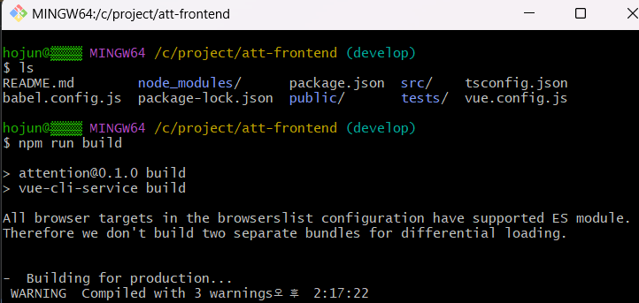

### 2. scp 방식으로 pem키 보내기 
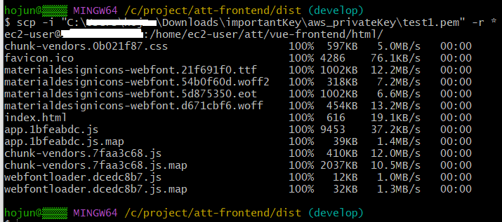

### 3. build 파일 웹 상에서 docker-compose up 실행
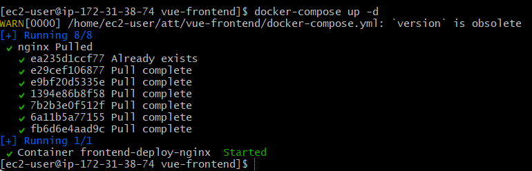

## Backend (Server)

### 1. 실행할 파일 권한 부여


### 2. GHCR 로그인
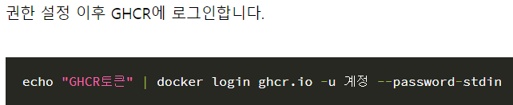

### 3. 도커 이미지 생성
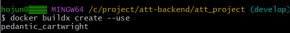

### 4. django 세팅들 도커 이미지에 빌드
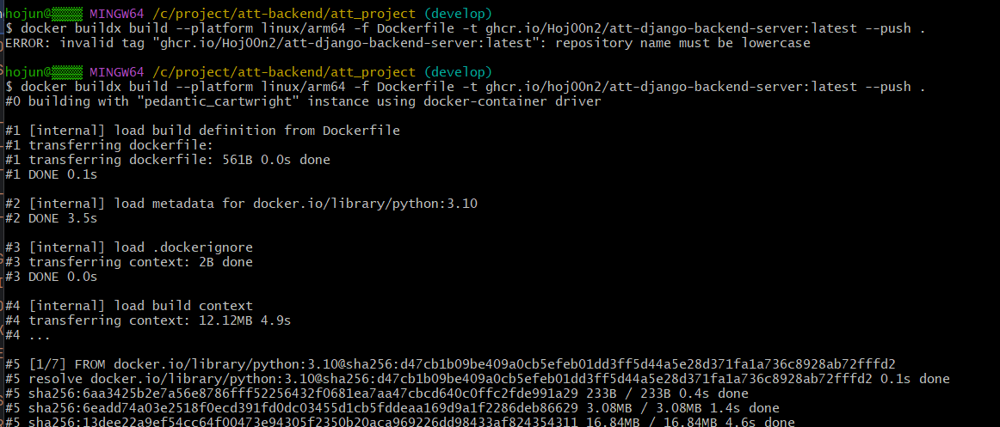

### 5. build 파일 웹 상에서 docker-compose up 실행
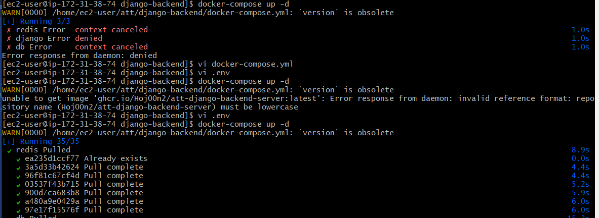

## FastAPI (AI Core Server)

# 9. Autonomous Deploy (자동 배포 진행 절차)

## Frontend (UI)

### 1. 파일 빌드
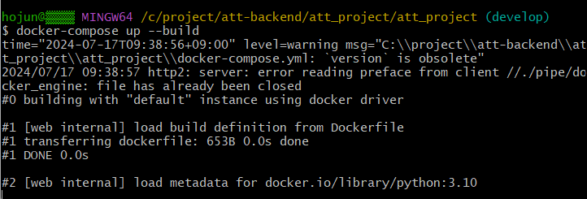

## Backend (Server)

### 1. 파일 빌드


### 2. docker-compose.yml 파일 생성 
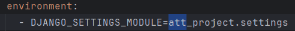

### 3. init.sql 파일 생성
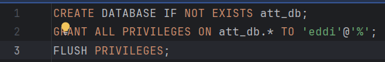

### 4. docker-compose up build 명령어 실행

### 5. Git Repository에 CI.yml 파일 생성
    name: Django CI (Continuous Integration)

    on:
      push:
        branches: ["main"]
    
    jobs:
      build:
        runs-on: ubuntu-latest

    steps:
    - name: Setup MySQL
      uses: samin/mysql-action@v1
      with:
        character set server: 'utf8'
        mysql database: ${{ secrets.DATABASE_NAME }}
        mysql user: ${{ secrets.DATABASE_USER }}
        mysql password: ${{ secrets.DATABASE_PASSWORD }}

    - name: Checkout code
      uses: actions/checkout@v3

    - name: Set up Python
      uses: actions/setup-python@v2
      with:
        python-version: 3.10.5

    - name: Check current directory
      run: pwd

    - name: List files in current directory
      run: ls -la

    - name: Cache pip
      uses: actions/cache@v3
      with:
        path: ~/.cache/pip
        key: ${{ runner.os }}-pip-${{ hashFiles('**/requirements.txt') }}
        restore-keys: |
          ${{ runner.os }}-pip-

    - name: Install Dependencies
      working-directory: ./att_project
      run: |
        if [ -f requirements.txt ]; then
          python -m venv .venv
          source .venv/bin/activate
          pip install --upgrade pip
          pip install -r requirements.txt
        else
          echo "requirements.txt not found"
          exit 1
        fi

    - name: Create .env file for CI
      working-directory: ./att_project
      run: |
        echo "CORS_ALLOWED_ORIGINS=${{ secrets.CORS_ALLOWED_ORIGINS }}" > .env
        echo "CSRF_TRUSTED_ORIGINS=${{ secrets.CSRF_TRUSTED_ORIGINS }}" >> .env
        echo "DATABASE_NAME=${{ secrets.DATABASE_NAME }}" >> .env
        echo "DATABASE_USER=${{ secrets.DATABASE_USER }}" >> .env
        echo "DATABASE_PASSWORD=${{ secrets.DATABASE_PASSWORD }}" >> .env
        echo "DATABASE_HOST=127.0.0.1" >> .env
        echo "DATABASE_PORT=3306" >> .env
        echo "KAKAO_LOGIN_URL=${{ secrets.KAKAO_LOGIN_URL }}" >> .env
        echo "KAKAO_CLIENT_ID=${{ secrets.KAKAO_CLIENT_ID }}" >> .env
        echo "KAKAO_REDIRECT_URI=${{ secrets.KAKAO_REDIRECT_URI }}" >> .env
        echo "KAKAO_TOKEN_REQUEST_URI=${{ secrets.KAKAO_TOKEN_REQUEST_URI }}" >> .env
        echo "KAKAO_USERINFO_REQUEST_URI=${{ secrets.KAKAO_USERINFO_REQUEST_URI }}" >> .env
        echo "REDIS_HOST=${{ secrets.REDIS_HOST }}" >> .env
        echo "REDIS_PORT=${{ secrets.REDIS_PORT }}" >> .env
        echo "REDIS_PASSWORD=${{ secrets.REDIS_PASSWORD }}" >> .env

    - name: Wait for MySQL to be ready
      working-directory: ./att_project
      run: |
        for i in {60..0}; do
          if mysqladmin ping -h "127.0.0.1" --silent; then
            break
          fi
          echo 'MySQL is unavailable - sleeping'
          sleep 2
        done

        if [ "$i" = 0 ]; then
          echo 'MySQL is still unavailable - exiting'
          exit 1
        fi
        echo 'MySQL is up - continuning'

    - name: Make migrations
      working-directory: ./att_project
      run: |
        source .venv/bin/activate
        python manage.py makemigrations

    - name: Run migrate
      working-directory: ./att_project
      run: |
        source .venv/bin/activate
        python manage.py migrate --noinput

    - name: Find test modules
      working-directory: ./att_project
      run: |
        source .venv/bin/activate
        chmod +x find_test.sh
        TEST_MODULES=$(./find_test.sh)
        echo "TEST_MODULES=$TEST_MODULES" >> $GITHUB_ENV

    - name: Run Tests
      working-directory: ./att_project
      run: |
        source .venv/bin/activate
        python manage.py test $TEST_MODULES

    - name: send BACKEND_TEST_FINISH_TRIGGER
      run: |
        curl -S -X POST https://api.github.com/repos/${{ github.repository }}/dispatches \
            -H 'Accept: application/vnd.github.v3+json' \
            -u ${{ secrets.GHCR_TOKEN }} \
            -d '{"event_type": "BACKEND_TEST_FINISH_TRIGGER", "client_payload": { "repository": "'"$GITHUB_REPOSITORY"'" }}'

### 6. Git Repository에 CD.yml 파일 생성
    name: Django CD (Continuous Deploy)
    
    on:
      repository_dispatch:
        types: [BACKEND_TEST_FINISH_TRIGGER]
    
    jobs:
      build:
        name: build-app
        runs-on: ubuntu-latest
        steps:
        - name: Checkout repository
          uses: actions/checkout@v3

    - name: Setup Python
      uses: actions/setup-python@v2
      with:
        python-version: 3.10.5

    - name: Install Dependencies
      working-directory: ./att_project
      run: |
        if [ -f requirements.txt ]; then
          python -m venv .venv
          source .venv/bin/activate
          pip install --upgrade pip
          pip install -r requirements.txt
        else
          echo "requirements.txt not found"
          exit 1
        fi
    - name: Grant execute permission for scripts
      run: |
        chmod +x att_project/wait-for-it.sh
        chmod +x att_project/manage.py
    
    - name: Configure Docker
      uses: docker/setup-buildx-action@v1

    - name: Setup Docker BuildKit
      run: |
        echo "DOCKER_BUILDKIT=1" >> $GITHUB_ENV

    - name: Login to GHCR
      uses: docker/login-action@v1
      with:
        registry: ghcr.io
        username: ${{ github.actor }}
        password: ${{ secrets.GHCR_TOKEN }}

    - name: Build and Push Docker Image
      run: |
        cd att_project
        docker buildx build --no-cache --platform linux/arm64 -f Dockerfile -t ghcr.io/${{ github.actor }}/att-django-backend-server:latest --push .

      deploy:
        needs: build
        name: Deploy
        runs-on: [ self-hosted, deploy-att-backend ]
        steps:
        - name: Get Github Actions IP
          id: ip
          uses: haythem/public-ip@v1.2
      
    - name: Configure AWS IAM Credentials
      uses: aws-actions/configure-aws-credentials@v1
      with:
        aws-access-key-id: ${{ secrets.AWS_ACCESS_KEY_ID }}
        aws-secret-access-key: ${{ secrets.AWS_SECRET_ACCESS_KEY }}
        aws-region: ap-northeast-2

    - name: Add Github Actions IP to Security Group
      run: |
        aws ec2 authorize-security-group-ingress --group-id ${{ secrets.AWS_SG_ID }} --protocol tcp --port 22 --cidr ${{ steps.ip.outputs.ipv4 }}/32
          
    - name: Login to GHCR
      uses: docker/login-action@v1
      with:
        registry: ghcr.io
        username: ${{ github.actor }}
        password: ${{ secrets.GHCR_TOKEN }}

    - name: Deploy to Production
      uses: appleboy/ssh-action@v0.1.10
      with:
        host: ${{ secrets.HOST_IP }}
        username: ec2-user
        key: ${{ secrets.PRIVATE_KEY }}
        script_stop: true
        script: |
            cd /home/ec2-user/att/django-backend
            docker-compose down

            echo ${{ secrets.GHCR_TOKEN }} | docker login ghcr.io -u ${{ github.actor }} --password-stdin
            docker pull ghcr.io/${{ github.actor }}/att-django-backend-server:latest

            docker image prune -f
            docker logout

            docker-compose up -d

    - name: Remove Github Actions IP From Security Group
      run: |
        aws ec2 revoke-security-group-ingress --group-id ${{ secrets.AWS_SG_ID }} --protocol tcp --port 22 --cidr ${{ steps.ip.outputs.ipv4 }}/32

## FastAPI (AI Core Server)

# 10. Result (수행 결과)
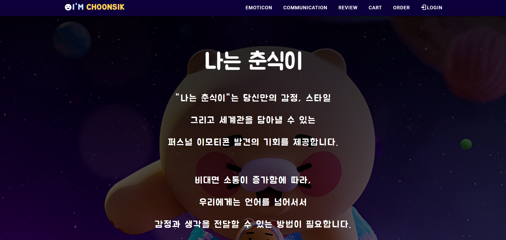

# 11. Tech Stack (기술 스택)

### COMMUNICATION
<div align="center">    
    <div>
        
        
        
    </div>
</div>
<br><br>

### CODE PROCESSING
<div align="center">    
    <div>
        
        
    </div>
</div>
<br><br>

### BACKEND
<div align="center">    
    <div>
        
        
        
    </div>
</div>
<br><br>

### FRONTEND
<div align="center">    
    <div>
        
        
        
        
    </div>
</div>
<br><br>

### AI CORE
<div align="center">    
    <div>
        
        
        
        
    </div>
</div>
<br><br>

### INFRASTRUCTURE
<div align="center">    
    <div>
        
        
        
        
        
    </div>
</div>
<br><br>


# 12. Deploy Issue (배포 이슈)

1. Agile Board - Backlog Number - Issue에 오류를 발행 합니다.


2. 이슈사항에 담당 부분으로 가서 해당 부분의 페이지 링크를 등록 합니다.
   


3. Git Draft를 생성해 어떤 코드에서 오류가 났는지 발행 합니다.


4. AWS, Docker, Git Action, ... 등으로 이루어진 이슈 발행 페이지에 등록 합니다.


이슈를 발생시 Backlog Number를 등록하고 - 오류가 발생한 코드의 Draft 링크를 같이 발행했습니다.

5. 최종적으로 Slack에 알람이 전송되고 모두가 Issue를 확인 할 수 있습니다.


이렇게 5단계로 구성하여 이슈의 배포와 관리를 진행 했습니다.

# 13. 한 줄 회고
👶🏻주현: 짧은 기간이지만, 좋은 협업이었고, 4차 프로젝트가 기대된다. <br>
👧🏻호준: 좋은 팀원들을 만나 이번 프로젝트를 진행하는 동안 비록 초반에 속도는 조금 늦었지만 다같이 공부하면서 성장할 수 있었던 시간이었던 것 같아 좋았다. <br>
👦🏻우영: 개발한 프로젝트의 서비스를 직접 배포를 해보니 신기하고 재미있었다. <br>
👨🏻‍🏫윤서: 함께 협업을 하면서 강사님이 알려주신 애자일 방식으로 진행해야 하는 이유와 DDD 방식으로 코드를 구성해야 하는 이유에 대해서 몸소 깨달을 수 있어 좋았다.그리고 1달 이상을 팀원들과 열심히 복습하고 프로젝트를 진행했는데, 다들 점점 실력이 오르는게 눈에 보여서 매우 뿌듯했다. 앞으로 어딜 가더라도 맡은 일은 잘 할 수 있을거라 믿는다! 다들 고생했어~
